# Requirements

To run this project you need:
- GitHub account
- Microsoft Azure account.
- [Azure CLI installed on local Machine](https://learn.microsoft.com/en-us/cli/azure/install-azure-cli)

## Project Plan
Trello project:
https://trello.com/b/77UTYCG9/udacity-devops

Spreadsheet:
https://github.com/DanielAcosta2395/udacity_cicd_flask_ml_app/blob/main/Udacity_CI_CD_Project_Plan.xlsx

## Instructions

## CI: Set Up Azure Cloud Shell
1. Launch an Azure Cloud Shell environment and create ssh-keys.

```
# Generate SSH public key
ssh-keygen -t rsa
```

You need to copy the public key (.pub)

2. Upload these keys to your GitHub account

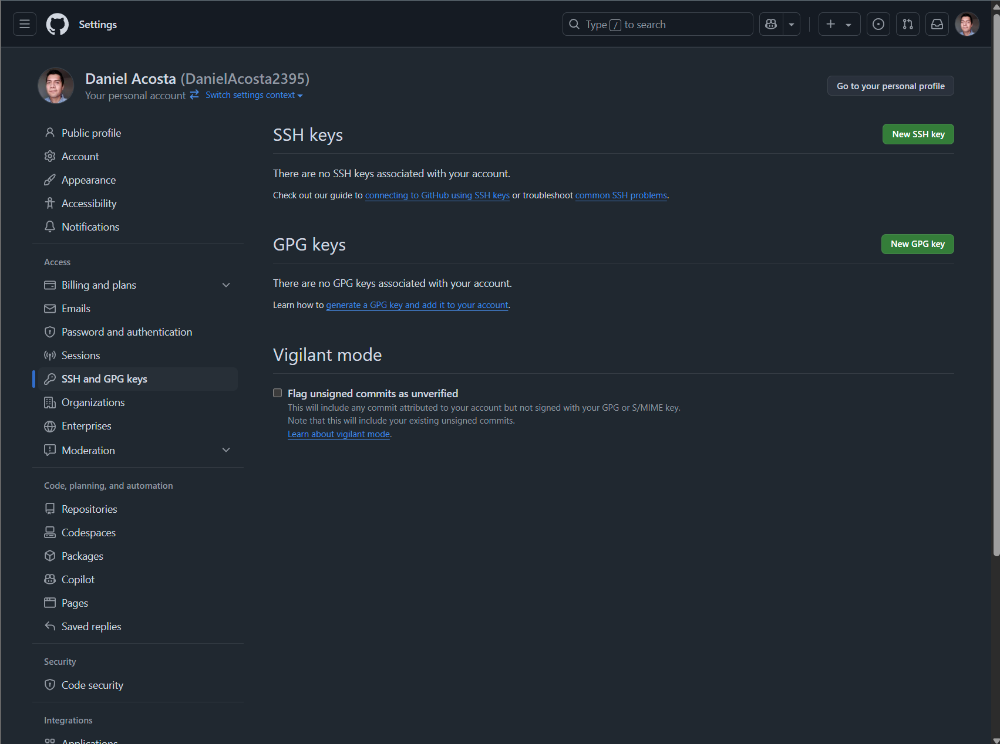

3. Clone the repo in the Azure Cloud Shell

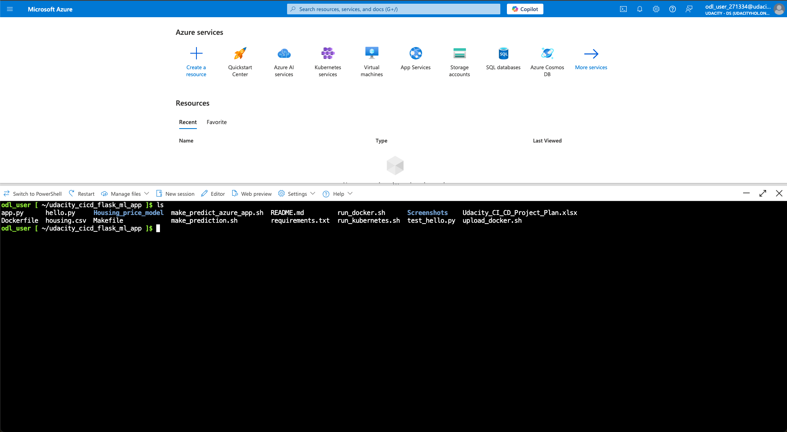

4. Create the Python Virtual Environment

```
python3 -m venv ~/.myrepo
source ~/.myrepo/bin/activate
```

5. Run ```make all``` inside the project root directory to run the tests

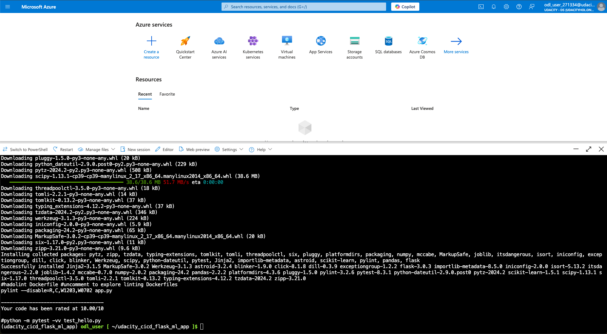

## CI: Configure GitHub Actions
1. Enable GitHub Actions in your account, this needs to be done in the repo settings.

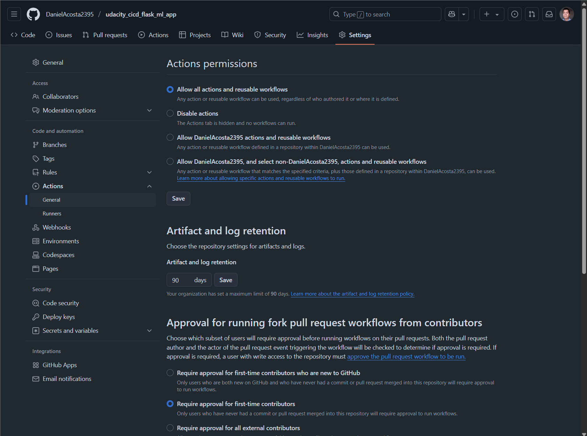

2. Push changes to GitHub and verify that both lint and test steps pass in your project.

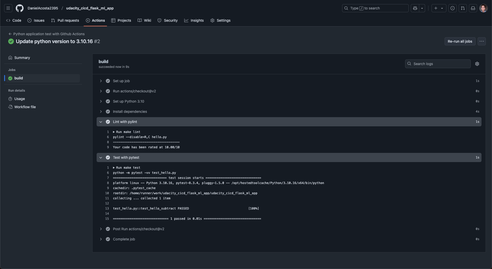

## Continous Delivery on Azure

1. Open a new terminal and run ```az login```


2. Then run the "commands.sh", this will create a new app service. Verify in the azure portal that you have a valid resource group, you can edit the file to write the app service name you want.

```sh ./commands.sh```

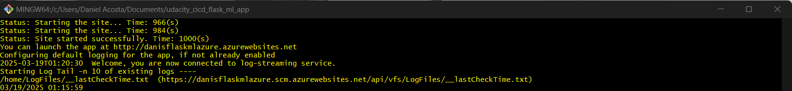

Noticed the name for the app service in the "commands.sh" file, this name needs to be referenced in the "make_predict_azure_app.sh" file.

3. Once the app service has been created, go to the Azure Portal, and search for the recently created rosurce:

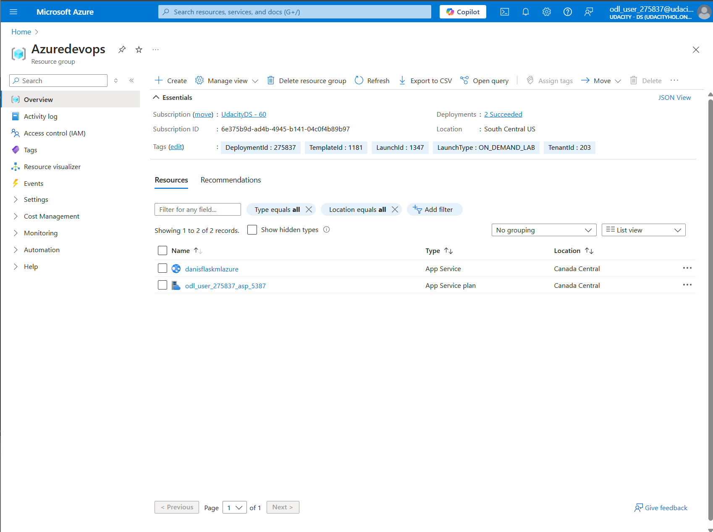


## Continous Delivery using Azure DevOps

1. Now in the Azure Portal search for "Azure DevOps organizations" and select the first option

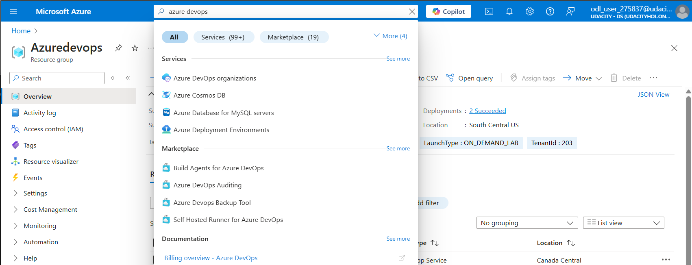

2. Click on "My Azure DevOps Organizations", you'll be redirected to the Azure DevOps portal, here you need to create a new organization if you don't have any.

3. Once the organization has been created, you need to create a new project:

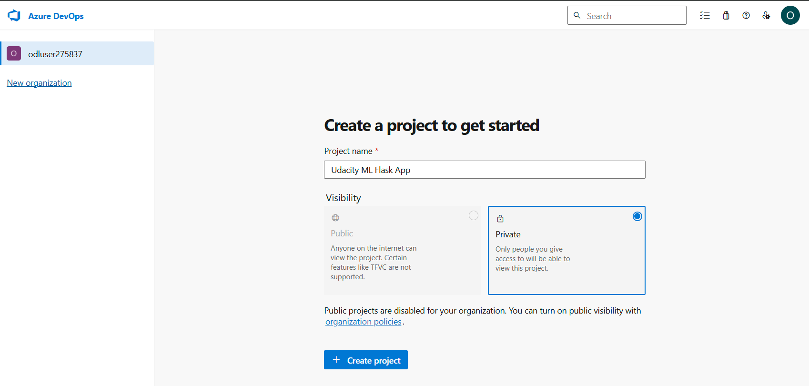

4. Select the GitHub option, and then you will be prompted to login an allow access to your GitHub account:

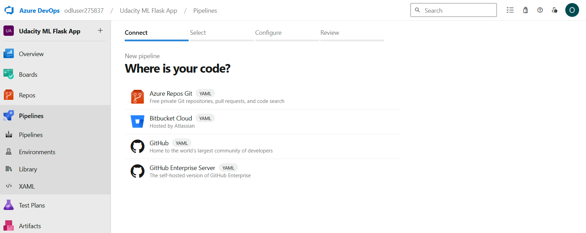

5. Select the repository you want to connect your pipeline:

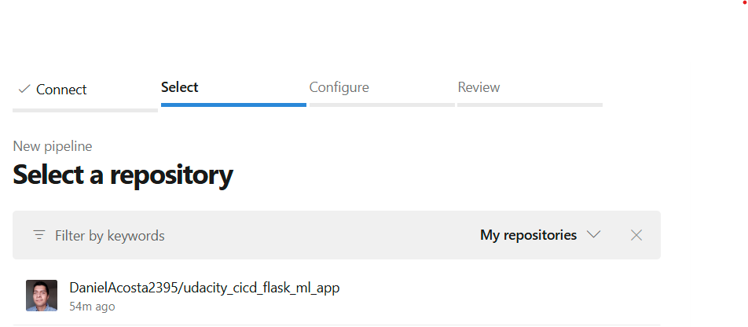

6. Select the option "Python to Linux Web App on Azure"

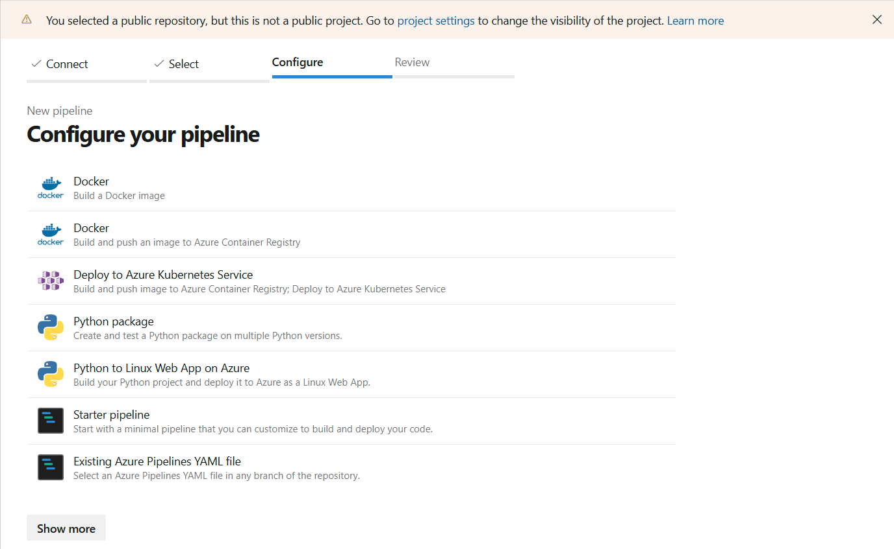

7. Then you need to select the subscription where your deployed the App Service.

8. You will have the list of available App services, select one and click on "Validate and Configure"

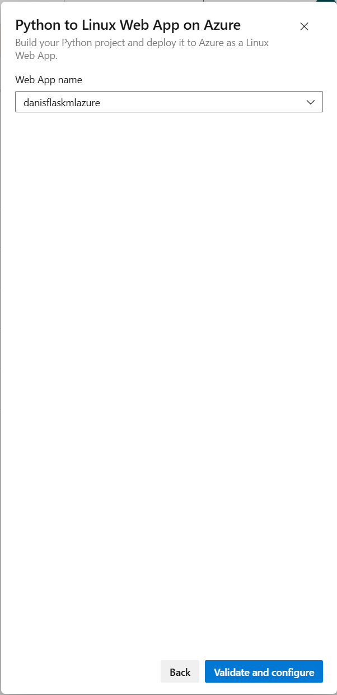


## Continous Delivery using GitHub actions

1. 


Create a Personal Access Token (PAT)
Create a new Personal Access Token (PAT) that will be used instead of a password by the build agent (Linux VM) for authentication/authorization. To create a PAT, go to home(opens in a new tab) and click on the top-right user icon, as shown below.

Create a new PAT, and ensure that it has a "Full access" scope. Save the PAT value for future use. You will not be able to view it again.

# Create an agent pool
An Agent pool is a collection of the agents (VMs) that will build your code and deploy it to the Azure services. The agent is the machine that does the processing job of the pipeline.

Go to the Project Settings > Agent pools and add a new agent pool, say myAgentPool.

Choose the agent pool as "Self-hosted". Provide the Agent pool a name as per your choice and grant access permissions to all pipelines.

# Create an Agent (VM)

Using UI:
Navigate to the "Virtual machines" service in the Azure Portal, and then select + Create to create a VM

Use the following values in the Create a virtual machine wizard:

Field	Value
Subscription	Choose existing
Resource group	Choose existing, say Azuredevops
Virtual machine name	myLinuxVM
Availability options	No infrastructure redundency required
Region	Select the region same that of the resource group
Image	Ubuntu Server 20.04 LTS - Gen1
Size	Standard_D1s_v2 (1 vCPU, 3.5 GB memory)
Authentication type	Password
Username	devopsagent
Password	DevOpsAgent@123
Public inbound ports	Allow selected ports
Select inbound ports: SSH (22)

Leave the remaining fields as default. Review and create the VM. It will take a few minutes for the deployment.

Running sh script:

# Configure the Agent (VM) - Install Docker

Copy the Public IP address from the overview section of the virtual machine

Run the following commands from an Azure cloud shell or terminal or command prompt. Replace the IP address as applicable to you:

```
ssh devopsagent@172.203.150.1
```

Accept the default prompts and provide the username and password as you have set up in the last step above.

After you SSH into the VM, install Docker(opens in a new tab) as:

```
sudo snap install docker
```

Check Python version because this agent will build your code

```
python3 --version
```

Configure the devopsagent user to run Docker

```
sudo groupadd docker
sudo usermod -aG docker $USER
exit
```

Restart the Linux VM from Azure portal to apply changes made in previous steps. Restarting the VM will log you out from the SSH log in. You will have to log back in using the same SSH command. Do note the new public IP, if it has been changed after the VM restart

# Configure the Agent (VM) - Install Agent Services

Go back to the DevOps portal, and open the newly created Agent pool to add a new agent.

Copy the commands to download, create and configure the Linux x64 agent. Make sure you copy your agent URL, not the one mentioned below

To download use:

```
curl -O <URL_COPIED_WHEN_CLICKING_DOWNLOAD_BUTTON>
```

The configuration will ask for the following prompts:

Prompt	Response
Accept the license agreement	Y
Server URL	Provide your Azure DevOps organization URL
For example, https://dev.azure.com/organization-name(opens in a new tab)
or
https://dev.azure.com/odluser193422(opens in a new tab)
Authentication type	[Press enter]
Personal access token	[Provide the PAT saved above]
Agent pool (enter the value)	Choose the one created above,
say myAgentPool
Agent name	[Press enter]
Work folder	[Press enter]

Run the following commands to finish the set up

```
sudo ./svc.sh install
sudo ./svc.sh start
```

```
pip install pylint==2.13.7 --break-system-packages
```

# Create a Starter Pipeline

Go back to the DevOps project, select Pipeline and create a new one.
Connect - Choose the Github repository as the source code location.
Select - Select the Github repository containing the exercise starter code.
Configure - Choose the Existing Azure Pipelines YAML file option. When you do not have any starter YAML file already, you can choose Starter pipeline option


<TODO:  
* Architectural Diagram (Shows how key parts of the system work)>

<TODO:  Instructions for running the Python project.  How could a user with no context run this project without asking you for any help.  Include screenshots with explicit steps to create that work. Be sure to at least include the following screenshots:

* Project running on Azure App Service

* Project cloned into Azure Cloud Shell

* Passing tests that are displayed after running the `make all` command from the `Makefile`

* Output of a test run

* Successful deploy of the project in Azure Pipelines.  [Note the official documentation should be referred to and double checked as you setup CI/CD](https://docs.microsoft.com/en-us/azure/devops/pipelines/ecosystems/python-webapp?view=azure-devops).

* Running Azure App Service from Azure Pipelines automatic deployment

* Successful prediction from deployed flask app in Azure Cloud Shell.  [Use this file as a template for the deployed prediction](https://github.com/udacity/nd082-Azure-Cloud-DevOps-Starter-Code/blob/master/C2-AgileDevelopmentwithAzure/project/starter_files/flask-sklearn/make_predict_azure_app.sh).
The output should look similar to this:

```bash
udacity@Azure:~$ ./make_predict_azure_app.sh
Port: 443
{"prediction":[20.35373177134412]}
```

* Output of streamed log files from deployed application

> 

## Enhancements

<TODO: A short description of how to improve the project in the future>

## Demo 

<TODO: Add link Screencast on YouTube>

