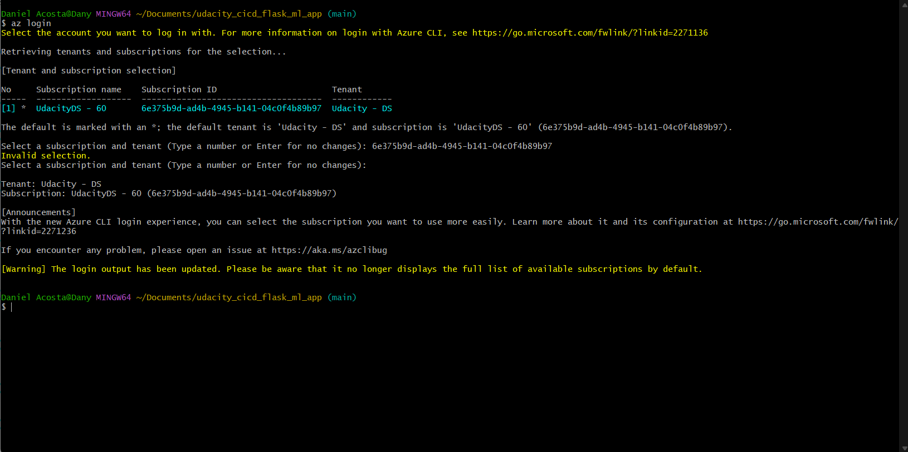

[](https://github.com/DanielAcosta2395/udacity_cicd_flask_ml_app/actions/workflows/main_danisflaskmlazure.yml)

# Requirements

To run this project you need:
- GitHub account
- Microsoft Azure account.
- [Azure CLI installed on local Machine](https://learn.microsoft.com/en-us/cli/azure/install-azure-cli)

## Project Plan
Trello project:
https://trello.com/b/77UTYCG9/udacity-devops

Spreadsheet:
https://github.com/DanielAcosta2395/udacity_cicd_flask_ml_app/blob/main/Udacity_CI_CD_Project_Plan.xlsx

## Instructions

## CI: Set Up Azure Cloud Shell
1. Launch an Azure Cloud Shell environment and create ssh-keys.

```
# Generate SSH public key
ssh-keygen -t rsa
```

You need to copy the public key (.pub)

2. Upload these keys to your GitHub account


3. Clone the repo in the Azure Cloud Shell


4. Create the Python Virtual Environment

```
python3 -m venv ~/.myrepo
source ~/.myrepo/bin/activate
```

5. Run ```make all``` inside the project root directory to run the tests


## CI: Configure GitHub Actions
1. Enable GitHub Actions in your account, this needs to be done in the repo settings.


2. Push changes to GitHub and verify that both lint and test steps pass in your project.


## Continous Delivery on Azure

1. Open a new terminal and run ```az login```



2. Then run the "commands.sh", this will create a new app service. Verify in the azure portal that you have a valid resource group, you can edit the file to write the app service name you want.

```sh ./commands.sh```


Noticed the name for the app service in the "commands.sh" file, this name needs to be referenced in the "make_predict_azure_app.sh" file.

3. Once the app service has been created, go to the Azure Portal, and search for the recently created rosurce:


## Continous Delivery using Azure DevOps

1. Now in the Azure Portal search for "Azure DevOps organizations" and select the first option


2. Click on "My Azure DevOps Organizations", you'll be redirected to the Azure DevOps portal, here you need to create a new organization if you don't have any.

3. Once the organization has been created, you need to create a new project:


4. Select the GitHub option, and then you will be prompted to login an allow access to your GitHub account:


5. Select the repository you want to connect your pipeline:


6. Select the option "Python to Linux Web App on Azure"


7. Then you need to select the subscription where your deployed the App Service.

8. You will have the list of available App services, select one and click on "Validate and Configure"


## Continous Delivery using GitHub actions

1. 


<TODO:  
* Architectural Diagram (Shows how key parts of the system work)>


* Successful deploy of the project in Azure Pipelines.  [Note the official documentation should be referred to and double checked as you setup CI/CD](https://docs.microsoft.com/en-us/azure/devops/pipelines/ecosystems/python-webapp?view=azure-devops).

* Output of streamed log files from deployed application

> 

## Enhancements

<TODO: A short description of how to improve the project in the future>

## Demo 

<TODO: Add link Screencast on YouTube>

